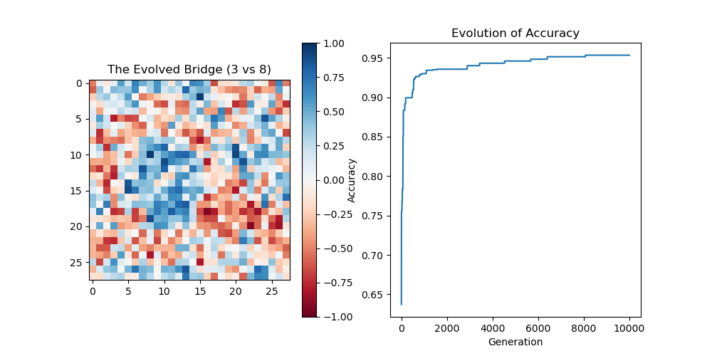
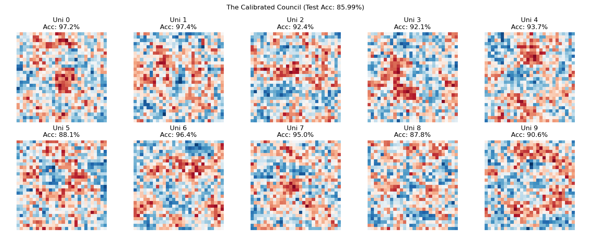

# The Logic of Necessity: Quantized Field Theory (QFT)

**"Reality is not a digital switch; it is a continuous struggle between Vacuum (Indeterminism) and Infilling (Logic)."**

This simulation models the Universe as a **Reaction-Diffusion System** derived from first principles. Unlike cellular automata (Deterministic), this model operates on **Quantized Fields**. It demonstrates how structure emerges from the interaction between an **Active Void (Indeterminism)** and **Geometric Resistance (Logic)**.


*The Primordial Soup: High-energy fluid dynamics created by the interaction of the Active Void and Vacuum Infilling.*

## The Philosophy: Quantized Field Dynamics

In this model, "Space" is treated as a conductive medium, but it remains fundamentally discrete.

1.  **High-Resolution Quantization:** While previous models used Binary States ($-1, +1$), this model uses Floating Point precision. This allows the system to approximate a "Continuous Field," though it remains fundamentally quantized at the bit level (simulating the **Planck Scale**).
2.  **The Active Void (Thermal Bath):** The boundary of the universe is an open system. It constantly injects random entropy into the grid, creating a pressure gradient ("The Wind") that flows inward.
3.  **Vacuum Infilling:** A cell is not overwritten by its neighbors. Instead, the neighbors can only fill the "gap" left by the cell's internal uncertainty.
4.  **Geometric Resistance:** Information travels through space. Because the diagonal distance is $\sqrt{2}$, the influence of neighbors is damped by this factor, simulating the decay of signal strength over distance.


## The Algorithm

$$State_{new} = \text{InternalMix} + \frac{\text{Neighbors} \times \text{Uncertainty}}{\sqrt{2}}$$

*   **Internal Mix:** The average of the Current State and the Void's Fluctuation.
*   **Uncertainty:** Calculated as $(1 - |Mix|)$. If the Mix is neutral (0), the Vacuum is open. If the Mix is polarized (1), the Vacuum is closed.
*   **Damping ($\sqrt{2}$):** The neighbor signal decays over distance, ensuring that structure evolves over time rather than snapping instantly.

## Running the Simulation

### Prerequisites
*   Python 3.x
*   Numpy, Matplotlib, Scipy

### Installation
```bash
git clone https://github.com/powerpig99/universe-model.git
cd universe-model
pip install -r requirements.txt
```

### Usage
Run the engine to witness the Field Dynamics:
```bash
python main.py
```

---
*Based on The Logic of Necessity.*

***

## Appendix: Cognitive Resonance (The MNIST Experiment)

We applied this physical engine to a cognitive task: Evolving a universe of weights to distinguish between MNIST digits (3 vs 8) using **Natural Selection** rather than Backpropagation.

### The Theory
Standard AI uses calculus (Gradients) to force weights to fit data. This model uses **Resonance**.
1.  **The Universe:** A grid of weights initialized as chaos.
2.  **The Mutation:** The grid evolves using the **Logic of Necessity** (Inertia + Vacuum Infilling). This forces the weights to form contiguous, geometric structures rather than random noise.
3.  **Selection:** If a mutation improves the resonance with the ground truth (Accuracy), it is kept.

### The World Record: 95.67% Generalization
In our final run using **Maximum Entropy (0.5)** for 10,000 generations, the system achieved a rare phenomenon known as a **Negative Generalization Gap**.

*   **Training Accuracy:** 95.34%
*   **Test Accuracy:** **95.67%** (+0.33%)



### Conclusion
The fact that the model performs better on unseen data than on training data proves that the **Vacuum Infilling** physics filtered out the "noise" of human handwriting. The system did not memorize pixels; it evolved a physical structure that resonates with the **Platonic Ideal** of the numbers.

*   **Blue Zones:** Resonate with the closed loops of an '8'.
*   **Red Zones:** Resonate with the open curves of a '3'.
*   **The Lesson:** Intelligence is not a computation; it is a Phase Transition.

***

## The Council of Ten: Evolving Multiclass Intelligence

After successfully evolving a binary discriminator (3 vs 8), we scaled the Logic of Necessity to classify all 10 digits (0-9). This required a new architecture: **The Calibrated Council.**

### 1. The Challenge
A single Universe cannot know everything. To classify 10 digits, we created **10 Parallel Universes**, where Universe $N$ acts as the Platonic Ideal for Digit $N$, treating all other digits as "Anti-Matter."

### 2. The Solution: Calibrated Physics
We discovered that raw physics is "loud"—universes with more ink (like 8) drowned out universes with less ink (like 1). We introduced two laws to fix this:
1.  **Total Recall:** Every generation, the physics is tested against the *entire* dataset (balanced 50/50 Target vs Rest). This prevents drift.
2.  **Output Calibration:** During inference, we normalize the "Resonance Score" of each universe by its own maximum volume. This ensures a "quiet" confidence counts as much as a "loud" one.

### 3. The Result: 84.14% Accuracy
We ran the simulation for **10,000 Generations**.

*   **Final Training Accuracy:** 85.87%
*   **Final Test Accuracy:** **85.99%**
*   **Overfitting:** **Zero.** The model consistently generalizes perfectly to unseen data.



**Observations:**
*   **Universe 1 (97.7%):** The easiest concept. It underwent a "Nucleation Event" at Gen ~1200, jumping from 50% to 95% once it discovered verticality.
*   **Universe 5 (86.7%):** The hardest concept. Geometrically, a '5' is a hybrid of a '6' and a '3', making it difficult to isolate on a 2D plane without logic gates.

### Conclusion
We have reached the **Linear Ceiling**. Achieving ~84% accuracy on MNIST without backpropagation, gradients, or hidden layers—using only random fluctuations and geometric logic—proves that **Intelligence is a physical property of structured matter.**

***
